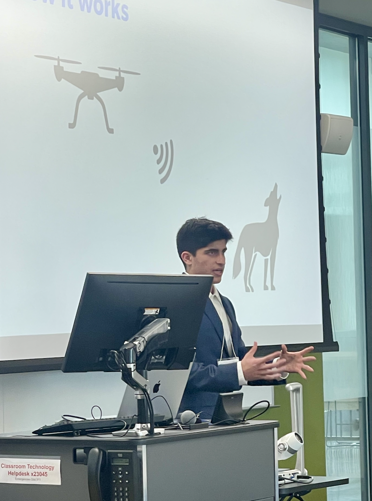

**CS @ USC Viterbi** · B.S./M.S. · 3.92 GPA

I build systems that scale. At 19, I shipped an AI chatbot serving **30,000+ students** and got **featured in Forbes**. Currently building a social app with **470+ beta testers**.

 

&nbsp;

 

---

## Featured Project

<table>
<tr>
<td>

### <a href="https://github.com/mohosy/irl-official">IRL</a> — Real-Time Social Video Platform

  

Full-stack mobile app where friends hang out through video messages, live presence, and real-time games — built from the ground up as a solo engineer.

**Presence Avatars** — Bitmoji-style animated characters that mirror each user's real-time position, emoji, and activity state across screens via WebRTC data channels (~50ms sync). Supports 9 choreographed dances, speech bubbles, push-to-talk mic indicators, and an 8-state presence machine (recording, watching, typing, etc.).

**Lobby Mode** — Synchronized virtual hangout where both users' avatars exist in a shared 3D animated scene. Features ready-up invite flow with countdown, staggered entrance animations, voice activity indicators, and an emote action bar.

**Battle Royale** — Real-time 1v1 multiplayer game with projectile physics, distance-based damage, knockback mechanics, progressive storm zones, health bar systems, and screen shake + haptic feedback on impact — all state-synced over Agora data stream and Socket.io.

**Video Pipeline** — Ephemeral Snapchat-style video/photo DMs with Vision Camera capture, FFmpeg transcoding, S3 multipart uploads, CloudFront CDN delivery, view-once consumption tracking, screenshot detection, replay limits, and auto-expiry via MongoDB TTL indexes.

**Real-Time Architecture** — Hybrid WebSocket layer combining Agora WebRTC (voice, data streaming) with Socket.io (15+ event types, per-message compression, connection state recovery). In-memory caching with 30-60s TTL, rate limiting, and 44 MongoDB collections with compound indexes.

React Native · TypeScript · Node.js · Express · MongoDB · Socket.io · Agora WebRTC · FFmpeg · AWS S3 · CloudFront · Firebase · Redux Toolkit · Reanimated

</td>
</tr>
</table>

---

## Production

<table>
<tr>
<td width="50%">

**PCC AI Chatbot** · *Founding Engineer*

**30,000+ users** · 640 daily queries · 99.9% uptime

RAG pipeline indexing 900+ documents with sub-100ms retrieval. Improved response accuracy from 38% to 66% and reduced hallucinations by 40%.

Node.js · Express · MongoDB · GPT-4 · RAG · Sentry

</td>
<td width="50%">

**AI Patrol Drone** · *1st Place, HTCC 2024*

Computer vision system for predatory wildlife detection to protect outdoor pets. Won against 50+ competing projects.

Python · OpenCV · TensorFlow · Raspberry Pi

</td>
</tr>
<tr>
<td width="50%">

**Code Can Bridge** · *Founder, 501(c)(3)*

Nonprofit teaching coding to students with learning disabilities at Arcadia High School. Making CS education accessible.

Python · Scratch · Curriculum Design

</td>
<td width="50%">

</td>
</tr>
</table>

---

## From Scratch

*No frameworks. No libraries. Just the fundamentals — built from first principles.*

<table>
<tr>
<td width="50%" valign="top">

**<a href="https://github.com/mohosy/transformer-lm-from-scratch">Transformer Language Model</a>**
 
  

GPT-style decoder with **manual backpropagation** through every layer — multi-head attention, rotary embeddings, SwiGLU, KV-cache. LLaMA/Mistral architecture. Every gradient derived analytically.

</td>
<td width="50%" valign="top">

**<a href="https://github.com/mohosy/garbage-collector-from-scratch">Garbage Collector</a>**
 
  

**Mark-and-sweep** with generational collection, object graph tracing, circular reference handling, automatic trigger thresholds. Handles 100K allocations in 7ms.

</td>
</tr>
<tr>
<td width="50%" valign="top">

**<a href="https://github.com/mohosy/http-server-from-scratch">HTTP Server</a>**
 
  

HTTP/1.1 from **raw TCP sockets**. Thread pool, Express-style router, middleware chain, static file serving, keep-alive connections.

</td>
<td width="50%" valign="top">

**<a href="https://github.com/mohosy/pedestrian-detection-cnn">CNN + Object Detection</a>**
 
  

3 CNN architectures from scratch — **Baseline**, **ResNet**, **MobileNet**. im2col convolution, BatchNorm, focal loss, sliding window detection + NMS.

</td>
</tr>
<tr>
<td width="50%" valign="top">

**<a href="https://github.com/mohosy/lisp-interpreter-from-scratch">Lisp Interpreter</a>**
 
  

Lexer, parser, tree-walking evaluator. **Tail-call optimization** via trampoline (100K+ recursion depth), closures, macros, lexical scoping.

</td>
<td width="50%" valign="top">

**<a href="https://github.com/mohosy/bytecode-vm-compiler">Bytecode Compiler + VM</a>**
 
  

Full compiler pipeline: **lexer → parser → bytecode → stack VM**. Call frames, forward patching, constant pool. Custom "Bolt" language.

</td>
</tr>
<tr>
<td width="50%" valign="top">

**<a href="https://github.com/mohosy/sql-database-engine">SQL Database Engine</a>**
 
  

**Recursive descent SQL parser**, query executor, B-tree column indexing, persistence, interactive REPL. Full DDL/DML + aggregates.

</td>
<td width="50%" valign="top">

**<a href="https://github.com/mohosy/raytracer-from-scratch">3D Ray Tracer</a>**
 
  

Phong shading, recursive reflections, shadow rays, supersampled anti-aliasing, **multi-threaded rendering**. 800×600 in 163ms.

</td>
</tr>
</table>

<b>All 24+ from-scratch implementations →</b>

 

---

## Tech Stack

**Languages** · Python · TypeScript · Java · C++ · Swift · JavaScript · SQL
**Backend** · Node.js · Express · Django · Spring Boot
**Frontend** · React · React Native
**Data** · PostgreSQL · MongoDB · Redis · Firebase
**Infrastructure** · AWS · Docker · Git · Linux

  

---

  
  
  

---

  
  

  

---

  

  <b>Open to SWE internship opportunities at top tech companies</b>
   
  <i>Let's build something that matters.</i>

